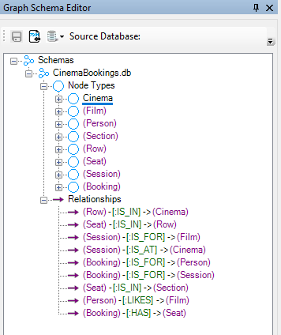

# Graph-Schema-JSON-Editor
GUI Editor to create JSON Graph Schema for Graph Databases and Relational Knowledge Graphs.

- **Import/Export Graph Schema JSON**, as per the Neo4j specification: https://github.com/neo4j/graph-schema-json-js-utils

- GUI Graph Schema Editor:

- Treats every database as if it is a Relational Knowledge Graph.

- GUI Application:

