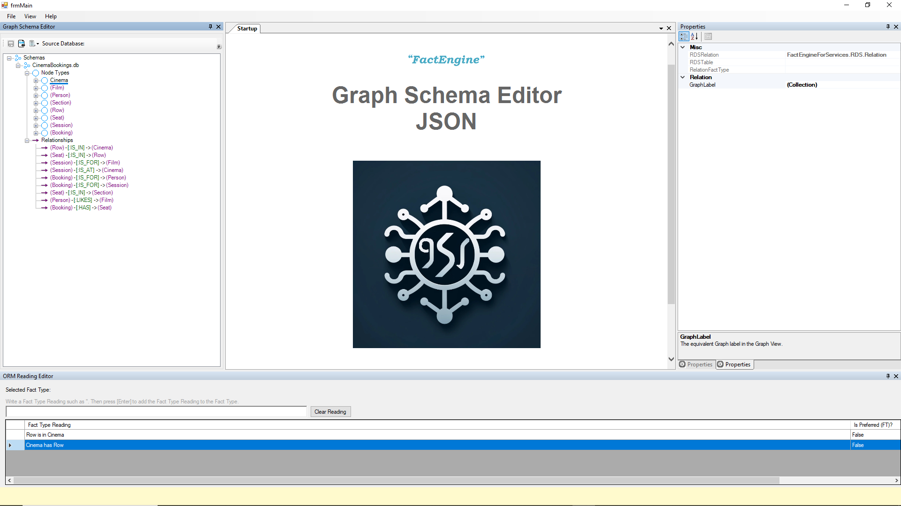

v0.9 Pre-Release

# Graph-Schema-JSON-Editor
GUI Editor to create JSON Graph Schema for Graph Databases and Relational Knowledge Graphs.

- **Import/Export Graph Schema JSON**, as per the Neo4j specification: https://github.com/neo4j/graph-schema-json-js-utils

- GUI Graph Schema Editor:

- Treats every database as if it is a Relational Knowledge Graph.

**NB** This visualisation for example purposes only. Not part of application.

- GUI Application:

**Licensing**
FactEngineForServices.dll: Licensed for educational use only and use within this software, Graph Schema JSON Editor. No commercial use or competing product use to Graph Schema JSON Editor is allowable. FactEngineForServices may be distributed with and for use of Graph Schema JSON Editor (this software). Please contact FactEngine for dual licensing. You may not reverse engineer the FactEngineForServices.dll

See About->Licensing for licensing of other utilities and images used in this software;
